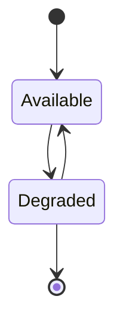

# Endpoint Recovery

<!--toc:start-->
- [Endpoint Recovery](#endpoint-recovery)
  - [References](#references)
  - [Relevant components](#relevant-components)
  - [Concerns](#concerns)
  - [Behaviours](#behaviours)
  - [Relevant MCTP commands, behaviours, and requirement constraints](#relevant-mctp-commands-behaviours-and-requirement-constraints)
  - [Requesting endpoint recovery from `mctpd`](#requesting-endpoint-recovery-from-mctpd)
  - [Endpoint health determinations and consequences](#endpoint-health-determinations-and-consequences)
  - [D-Bus interface discussion](#d-bus-interface-discussion)
  - [Proposed Design](#proposed-design)
    - [`.Recover` method design considerations](#recover-method-design-considerations)
    - [Application behaviours over an endpoint recovery sequence](#application-behaviours-over-an-endpoint-recovery-sequence)
    - [`mctpd` behaviours over an endpoint recovery sequence](#mctpd-behaviours-over-an-endpoint-recovery-sequence)
  - [MCTP device lifecycle and consuming events from `mctpd` D-Bus objects](#mctp-device-lifecycle-and-consuming-events-from-mctpd-d-bus-objects)
    - [An example order of MCTP device events, consumed by `nvmesensor`](#an-example-order-of-mctp-device-events-consumed-by-nvmesensor)
<!--toc:end-->

Here we capture some reasoning around a design and implementation of device
presence detection and EID reclaim.

## References

1. [DSP0236 - Management Component Transport Protocol (MCTP) Base Specification][dmtf-dsp0236]
2. [DSP0237 - Management Component Transport Protocol (MCTP) SMBus/I2C Transport Binding Specification][dmtf-dsp0237]
3. [DSP0239 - Management Component Transport Protocol (MCTP) IDs and Codes][dmtf-dsp0239]
3. [Freedesktop: D-Bus Specification][dbus-spec]

[dmtf-dsp0236]: https://www.dmtf.org/sites/default/files/standards/documents/DSP0236_1.3.1.pdf
[dmtf-dsp0237]: https://www.dmtf.org/sites/default/files/standards/documents/DSP0237_1.2.0.pdf
[dmtf-dsp0239]: https://www.dmtf.org/sites/default/files/standards/documents/DSP0239_1.10.0.pdf
[dbus-spec]: https://dbus.freedesktop.org/doc/dbus-specification.html

## Relevant components

1. Endpoint devices, such as NVMe drives
2. I2C buses
3. `fru-device`
4. `entity-manager`
5. Client applications, such as `nvmesensor`
6. `mctpd`

## Concerns

It's reasonable for clients like `nvmesensor` to identify issues with the NVMe
subsystem, but it's possible that communication errors could be a result of
issues on the underlying transport.

We try to place the detection and recovery effort at the appropriate layer in
the communication stack.

Concretely, `nvmesensor` periodically issues a `Controller Health Status Poll`
to monitored drives. Polling may fail due to issues with the subsystem or due to
more fundamental issues like the endpoint being removed from the bus. In the
cases where `nvmesensor` determines it shouldn't own the problem of monitoring
for resumed communications it should punt the polling to `mctpd`.

## Behaviours

Reasons for temporary loss of e.g. NVMe-MI communication at the MCTP layer
include:

1. I2C bus recovery by the controller
2. I2C bus contention and loss of arbitration
3. Transparent MCTP proxy hardware dropping communication
4. Hot-(un)plug of the endpoint device

## Relevant MCTP commands, behaviours, and requirement constraints

1. Use of `Get Endpoint ID` for polling
2. Use of `Get Endpoint UUID` to track device exchange

Substatiating 1, from [DSP0236 v1.3.1 8.17.6 Reclaiming EIDs from hot-plug
devices][dmtf-dsp0236] we have:

> - The bus owner shall wait at least `Treclaim` seconds before reassigning a
>   given EID (where `Treclaim` is specified in the physical transport binding
>   specification for the medium used to access the endpoint).
>
> - Reclaimed EIDs shall only be reassigned after all unused EIDs in the EID
>   pool have been assigned to endpoints. Optionally, additional robustness
>   can be achieved if the bus owner maintains a short FIFO list of reclaimed
>   EIDs (and their associated physical addresses) and allocates the older EIDs
>   first.
>
> - A bus owner shall confirm that an endpoint has been removed by attempting
>   to access it after `Treclaim` has expired. It can do this by issuing a `Get
>   Endpoint ID` command to the endpoint to verify that the endpoint is still
>   non-responsive. It is recommended that this be done at least three times,
>   with a delay of at least `1/2 * Treclaim` between tries if possible. If the
>   endpoint continues to be non-responsive, it can be assumed that it is safe
>   to return its EID to the pool of EIDs available for assignment.

We're concerned with the `Treclaim` relevant to NVMe-MI devices for now, which
leads us to DSP0237. [DSP0237 v1.2.0 6.19][dmtf-dsp0237] defines `Treclaim` as 5
seconds. The same section also defines `MN1` (Number of request retries) with a
minimum of `2`. A retry is specifically a transmission attempt after the initial
transmission, so an `MN1` minimum of 2 implies at least three messages will be
sent, in line with the suggestion from DSP0236.

## Requesting endpoint recovery from `mctpd`

We wish to avoid continuous polling of devices by `mctpd` for a few reasons:

1. Interleaving of commands to simple endpoints
2. The increase bus utilisation increases the probability of contention and loss
   of arbitration

Given this, `nvmesensor` and any other daemons using MCTP as a transport need
some way to request polling be performed. `mctpd` already exposes D-Bus APIs for
endpoint management - we will add another for this purpose.

## Endpoint health determinations and consequences

There are several possible outcomes upon an application such as `nvmesensor`
requesting `mctpd` recover communication with an endpoint:

1. `mctpd` issues `Get Endpoint ID` to the device and finds no sign of failure -
   the device responds without requiring a retry.

2. `mctpd` issues `Get Endpoint ID` to the device and initially finds it
   unresponsive, but the device recovers and responds to a retry attempt before
   `Treclaim`.

3. `mctpd` issues `Get Endpoint ID` to the device. The device fails to respond
   to the initial query and all subsequent retries up to `Treclaim`.

In the case of the third scenario MCTP defines the device as removed until some
later event re-establishes its presence. If a device is considered removed then
the D-Bus object representing the device must also be removed.

Conversely, in scenarios 1 and 2 the device should not be considered removed
as communication was re-established prior to `Treclaim`. Until `Treclaim` the
device exists in an intermediate state where it's expected to be present but
its presence is undetermined. As such, its D-Bus object should also remain, but
we need to acknowledge to interested applications that there are communication
issues. This may include applications in addition to the process which requested
`mctpd` recover communication with the endpoint.

## D-Bus interface discussion

`mctpd` currently structures its D-Bus objects as follows:

```
root@cc-nvme-mi:~# busctl tree au.com.codeconstruct.MCTP1
└─/au
  └─/au/com
    └─/au/com/codeconstruct
      └─/au/com/codeconstruct/mctp1
        ├─/au/com/codeconstruct/mctp1/networks/1
        │ └─/au/com/codeconstruct/mctp1/networks/1/endpoints/12
          ├─/au/com/codeconstruct/mctp1/networks/1/endpoints/8
          └─/au/com/codeconstruct/mctp1/networks/1/endpoints/9
```

```
root@cc-nvme-mi:~# busctl introspect au.com.codeconstruct.MCTP1 /au/com/codeconstruct/mctp1
NAME                                TYPE      SIGNATURE  RESULT/VALUE  FLAGS
au.com.codeconstruct.Endpoint1      interface -          -             -
.AssignEndpoint                     method    say        yisb          -
.LearnEndpoint                      method    say        yisb          -
.SetupEndpoint                      method    say        yisb          -
org.freedesktop.DBus.Introspectable interface -          -             -
.Introspect                         method    -          s             -
org.freedesktop.DBus.ObjectManager  interface -          -             -
.GetManagedObjects                  method    -          a{oa{sa{sv}}} -
.InterfacesAdded                    signal    oa{sa{sv}} -             -
.InterfacesRemoved                  signal    oas        -             -
org.freedesktop.DBus.Peer           interface -          -             -
.GetMachineId                       method    -          s             -
.Ping                               method    -          -             -
org.freedesktop.DBus.Properties     interface -          -             -
.Get                                method    ss         v             -
.GetAll                             method    s          a{sv}         -
.Set                                method    ssv        -             -
.PropertiesChanged                  signal    sa{sv}as   -             -
```

```
root@cc-nvme-mi:~# busctl introspect au.com.codeconstruct.MCTP1 /au/com/codecontrust/mctp1/networks/1
NAME                                TYPE      SIGNATURE RESULT/VALUE FLAGS
org.freedesktop.DBus.Introspectable interface -         -            -
.Introspect                         method    -         s            -
org.freedesktop.DBus.Peer           interface -         -            -
.GetMachineId                       method    -         s            -
.Ping                               method    -         -            -
org.freedesktop.DBus.Properties     interface -         -            -
.Get                                method    ss        v            -
.GetAll                             method    s         a{sv}        -
.Set                                method    ssv       -            -
.PropertiesChanged                  signal    sa{sv}as  -            -
```

```
root@cc-nvme-mi:~# busctl introspect au.com.codeconstruct.MCTP1 /au/com/codecontrust/mctp1/networks/1/endpoints/9
NAME                                TYPE      SIGNATURE RESULT/VALUE                           FLAGS
au.com.codeconstruct.MCTP.Endpoint1 interface -         -                                      -
.Remove                             method    -         -                                      -
.SetMTU                             method    u         -                                      -
org.freedesktop.DBus.Introspectable interface -         -                                      -
.Introspect                         method    -         s                                      -
org.freedesktop.DBus.Peer           interface -         -                                      -
.GetMachineId                       method    -         s                                      -
.Ping                               method    -         -                                      -
org.freedesktop.DBus.Properties     interface -         -                                      -
.Get                                method    ss        v                                      -
.GetAll                             method    s         a{sv}                                  -
.Set                                method    ssv       -                                      -
.PropertiesChanged                  signal    sa{sv}as  -                                      -
xyz.openbmc_project.Common.UUID     interface -         -                                      -
.UUID                               property  s         "595a522d-77c5-4628-8400-37bfb41b710c" const
xyz.openbmc_project.MCTP.Endpoint   interface -         -                                      -
.EID                                property  y         9                                      const
.NetworkId                          property  i         1                                      const
.SupportedMessageTypes              property  ay        1 0                                    const
```

The problem we have deals with specific endpoints. To satisfy the third scenario
the object `/au/com/codeconstruct/mctp1/networks/1/endpoints/9` would be removed.

For scenarios 1 and 2 we need to add capabilities on the endpoint object. The
`au.com.codeconstruct.MCTP.Endpoint` already exposes endpoint control APIs, and
given we're not removing capabilities we can change it.

## Proposed Design

The approach is to add a `.Recover` method and a `.Connectivity` property to the
`au.com.codeconstruct.MCTP.Endpoint1` interface. `.Recover` takes no arguments,
produces no result, and returns immediately. `.Connectivity` takes one of two
values:

- `Available`
- `Degraded`

When `.Recover` is invoked `mctpd` transitions `.Connectivity` to `Degraded`,
then queries the device with `Get Endpoint ID`. `.Recover` responds on D-Bus
after `Get Endpoint ID` has been issued and before a response is received.
A valid response received from a `Get Endpoint ID` query transmitted inside
`Treclaim` leads to `.Connectivity` transitioning to `Available`. If a response
is not received to a `Get Endpoint ID` query issued inside `Treclaim` then
`mctpd` removes the endpoint's D-Bus object.



### `.Recover` method design considerations

There are several possible design points for `.Recover`:

1. Withold a response until communication with the device is recovered or the
   device is considered removed after `Treclaim`, and respond with the overall
   result

2. Withold a response until the first `Get Endpoint ID` query has resolved,
   either via a timely response or via a timeout, and respond with the result of
   this first query

3. Immediately respond prior to resolving the first `Get Endpoint ID query`
   without providing a result

Option 1 is not feasible for two reasons:

- DSP0236 punts definition of `Treclaim` to the transport binding
  specifications, and

- D-Bus punts the entire concept of method call timeouts to the
  implementation[^1], which are often configurable

[^1]: As best I can see there's no definition of timeouts in the [method call
      section of the specification][dbus-spec-message-protocol-types-method].
      [`4a85d321b451`][dbus-reference-timeout-commit] is the first introduction
      of the concept of method call timeouts in the D-Bus reference
      implementation, back in 2003.

[dbus-spec-message-protocol-types-method]: https://dbus.freedesktop.org/doc/dbus-specification.html#message-protocol-types-method
[dbus-reference-timeout-commit]: https://gitlab.freedesktop.org/dbus/dbus/-/commit/4a85d321b4516c6a663e8bdd530ba59018c974df

As we can't assume appropriate values for either of those behaviours we should
design an interfaces that avoids putting constraints on them. This drives
introducing the `.Connectivity` member as an asynchronous signal of recovery
progress.

Option 3 requires we rely entirely on signals from `.Connectivity` to drive
a state machine in interested applications. This may feel heavy-handed and
thus tempting to implement option 2 for the happy case where recovery
immediately succeeds. However, option 2 requires interested applications
implement two separate code paths to handle recovery, which seems questionable
from the perspective of correctness, robustness and maintenance.

### Application behaviours over an endpoint recovery sequence

The impact of changes to `.Connectivity` can be divided across two classes of
application:

1. The application invoking `.Recover` on a given endpoint `A`
2. Applications communicating with `A` that have not entered a state where
   recovery was considered necessary

For an application to invoke `.Recover` it must already consider the endpoint
unresponsive, therefore it seems reasonable to assume it won't continue
communicating with the endpoint unless the recovery succeeds. As such there's
no action required when `.Connectivity` transitions to `Degraded`. However,
if recovery succeeds, the transition of `.Connectivity` from `Degraded` to
`Available` provides the signal to restart communicating with the endpoint.

For applications in the second class it is likely the case that they
haven't themselves invoked `.Recover` because they are yet to observe a
communication failure with the endpoint. As such there's also no requirement
for action when `.Connectivity` transitions to `Degraded` on behalf of another
application. However, it may be the case that communication failures are
subsequently observed. It's not necessary to invoke `.Recover` if
`.Connectivity` is already in `Degraded`, though there should also be no
significant consequences if it occurs. If no communication failures are observed
while `.Connectivity` is in `Degraded` then there's also no action required if
it transitions to `Available`.

### `mctpd` behaviours over an endpoint recovery sequence

For hotplug devices recovering from a reset `Get Endpoint ID` should yield an
EID of 0.

Note that while we're under the `Treclaim` period the device's allocated EID has
not been quarantined to the reuse FIFO, and is also not a member of the dynamic
allocation pool. For the purposes of allocation, the device is still assigned
the EID it had prior to taking a reset. If a device at the physical address of
the device in `Degraded` responds to `Get Endpoint ID` with an EID of 0 inside
the `Treclaim` period and has a UUID that matches the device in `Degraded`, then
it should be reassigned its allocated EID. At the end of this sequence the
reassignment should not be observable to MCTP-application-layer beyond the
endpoint's `.Connectivity` member transitioning from `Degraded` to `Available`.

## MCTP device lifecycle and consuming events from `mctpd` D-Bus objects

The general strategy for tracking endpoint lifecycles is [as follows]
[dbus-spec-standard-interfaces-objectmanager]:

[dbus-spec-standard-interfaces-objectmanager]: https://dbus.freedesktop.org/doc/dbus-specification.html#standard-interfaces-objectmanager

1. Add a match of the following form for event-driven updates to local
   data-structures

   ```
   type='signal',sender='xyz.openbmc_project.MCTP',path_namespace='/au/com/codeconstruct/mctp1'
   ```

2. Issue a call to `GetManagedObjects` `org.freedesktop.DBus.ObjectManager` on
   `/au/com/codeconstruct/mctp1` for initial population of local data-structures

3. Issue

### An example order of MCTP device events, consumed by `nvmesensor`

1. A series of events yields a new FRU EEPROM device on an I2C bus already
   registered as an MCTP endpoint.

2. The FRU data is decoded and `SetupEndpoint` on the
   `au.com.codeconstruct.MCTP.BusOwner1.DRAFT` interface of the
   `/au/com/codeconstruct/mctp1`
   object hosted by `mctpd` is invoked.

3. The device was not previously configured and has no programmed static EID.
   `mctpd` allocates an EID (9) from its dynamic pool and assigns it to the
   device.

4. `mctpd` [emits an `InterfacesAdded` signal][dbus-spec-standard-interfaces-objectmanager]
   with the following contents (represented as JSON, trimmed to relevant
   interfaces):

   ```
   "/au.com.codeconstruct/mctp1/networks/1/endpoints/9": {
     "au.com.codeconstruct.MCTP.Endpoint1": { },
     "xyz.openbmc_project.Common.UUID": {
       "UUID": "..."
     },
     "xyz.openbmc_project.MCTP.Endpoint": {
       "EID": 9,
       "NetworkId": 1,
       "SupportedMessageTypes": [ 0, 4 ],
     }
   }
   ```

5. The device indicates support for message type `4`, ["NVM Express Management
   Messages over MCTP"][dmtf-dsp0239]. `nvmesensor` updates its local data-structures to
   capture the appearance of a new NVMe device.

6. `nvmesensor` begins managing the NVMe device via NVMe-MI.

7. MCTP endpoint 9 stops responding to NVMe-MI commands from `nvmesensor`.

8. `nvmesensor` calls the `Recover` method on the
   `au.com.codeconstruct.MCTP.Endpoint1` of the
   `/au/com/codeconstruct/mctp1/networks/1/endpoints/9`
   D-Bus object hosted by `mctpd`. This may occur via e.g. failure to regularly
   poll the drive CTEMP.

9. `mctpd` [emits a `PropertiesChanged` signal][dbus-spec-standard-interfaces-properties]
   from `/au/com/codeconstruct/mctp/networks/1/endpoints/9` with the following
   contents:

   ```
   [
     "au.com.codeconstruct.MCTP.Endpoint1",
     { "Connectivity": "Degraded" },
     { }
   ]
   ```

10. `nvmesensor` receives the `Degraded` `PropertiesChanged` event moves the
    drive's NVMe subsystem into the `Status::Stop` state

11. `mctpd` polls for the presence of the device using `Get Endpoint ID` in accordance with
    [8.17.6][dmtf-dsp0236]

12. The device fails to respond to all (retried) queries issued inside `Treclaim`.

13. `mctpd` removes `/au/com/codeconstruct/mctp1/networks/1/endpoints/9` from
    D-Bus, emitting an `InterfacesRemoved` signal with the following content

    ```
    "/au/com/codeconstruct/mctp1/networks/1/endpoints/9": [
      "au.com.codeconstruct.MCTP.Endpoint1",
      "xyz.openbmc_project.MCTP.Endpoint",
      ...
    ]
    ```

14. `nvmesensor` receives the `InterfacesRemoved` signal and cleans up its
    representation of the device from its idle state.

[dbus-spec-standard-interfaces-properties]: https://dbus.freedesktop.org/doc/dbus-specification.html#standard-interfaces-properties
